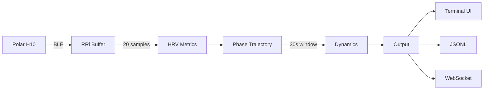

# EarthianBioSense

Biosignal acquisition and streaming client for the Earthian Ecological Coherence Protocol (EECP).

Connects to Polar H10 heart rate monitors via BLE, computes HRV metrics, and tracks autonomic state as a trajectory through phase space.

## What It Does

- **BLE connection** to Polar H10 (heart rate + RR intervals)
- **HRV metrics**: amplitude, entrainment (breath-heart coupling), breath rate estimation
- **Phase space trajectory**: tracks movement through a 3D manifold (entrainment, breath, amplitude)
- **Dynamics computation**: velocity, curvature, stability — not just where you are, but how you're moving
- **Terminal UI**: real-time ASCII visualization
- **JSONL export**: full trajectory data for post-session analysis

## Installation

```bash
git clone https://github.com/m3data/earthian-biosense.git
cd Earthian-BioSense
python -m venv venv
source venv/bin/activate
pip install -r requirements.txt
```

## Usage

```bash
python src/app.py
```

Wear your Polar H10 strap (requires skin contact to activate), ensure Bluetooth is enabled and the device isn't connected to another app.

Session data is saved to `sessions/YYYY-MM-DD_HHMMSS.jsonl`.

## Phase Labels

Labels emerge from trajectory dynamics, not just thresholds:

| Label | Meaning |
|-------|---------|
| `warming up` | Insufficient data |
| `alert stillness` | Stable but low coherence — watchful calm |
| `active transition` | Moving through phase space |
| `inflection (seeking)` | High curvature, turning point, seeking coherence |
| `inflection (from coherence)` | High curvature, dropping from coherent state |
| `settling into coherence` | Low velocity/curvature, high coherence — dwelling |
| `coherent dwelling` | Stable in coherent region |
| `neutral dwelling` | Stable, mid-coherence |

## JSONL Output

Each line contains:

```json
{
  "ts": "2025-12-01T16:49:18.274140",
  "hr": 86,
  "rr": [640, 634, 637],
  "metrics": {
    "amp": 164,
    "ent": 0.576,
    "ent_label": "[entrained]",
    "breath": 6.2,
    "volatility": 0.0825,
    "mode": "settling",
    "mode_score": 0.543
  },
  "phase": {
    "position": [0.5759, 0.5, 0.82],
    "velocity": [0.0413, 0.0, 0.0333],
    "velocity_mag": 0.0531,
    "curvature": 0.047,
    "stability": 0.8672,
    "history_signature": 0.2292,
    "phase_label": "settling into coherence",
    "coherence": 0.55,
    "movement_annotation": "settling from heightened alertness",
    "movement_aware_label": "settling · from heightened alertness"
  }
}
```

## EECP Context

EarthianBioSense is one of three clients in the Earthian Ecological Coherence Protocol ecosystem:

```
┌─────────────────┬─────────────────┬─────────────────┐
│ EarthianBioSense│ Semantic Climate│ EECP Field      │
│ (this repo)     │ Client          │ Journal         │
├─────────────────┼─────────────────┼─────────────────┤
│ Biosignal       │ Semiotic        │ Phenomenological│
│ Stream          │ Stream          │ Stream          │
└─────────────────┴─────────────────┴─────────────────┘
                          ↓
            Ecological Coherence Detection
```

Coherence emerges when computational (Semantic Climate) and somatic (EBS) signatures shift together.

## Architecture



See [docs/overview.md](docs/overview.md) for detailed architecture.

## Requirements

- Python 3.11+
- Polar H10 heart rate monitor
- macOS/Linux with Bluetooth

## License

All rights reserved. This is private research software. No license is granted for use, modification, or distribution without explicit written permission from the author.

---

*"Each moment is a point on a trajectory, not a dot on a line. Movement matters."*
