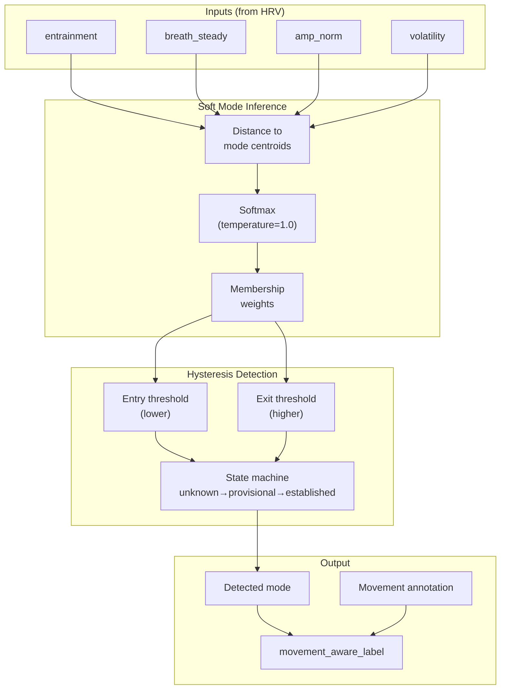
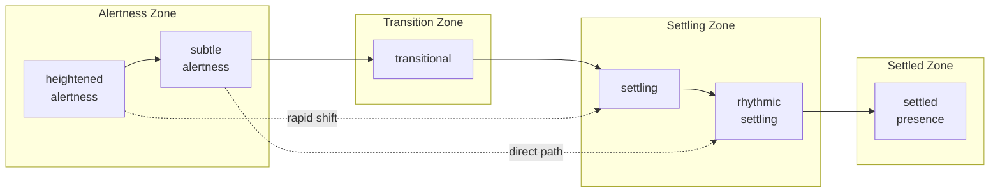
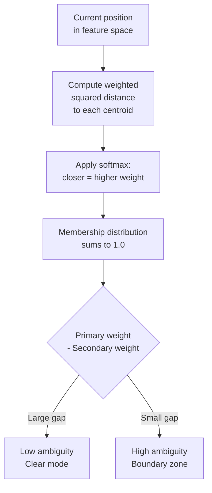
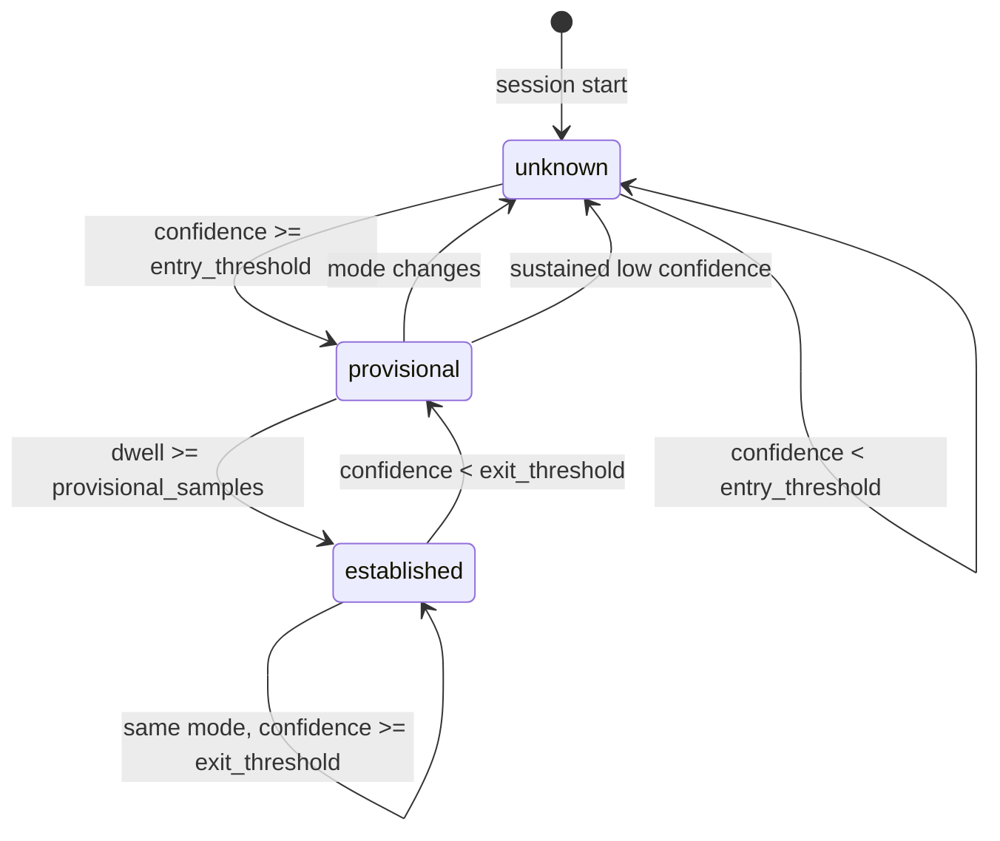
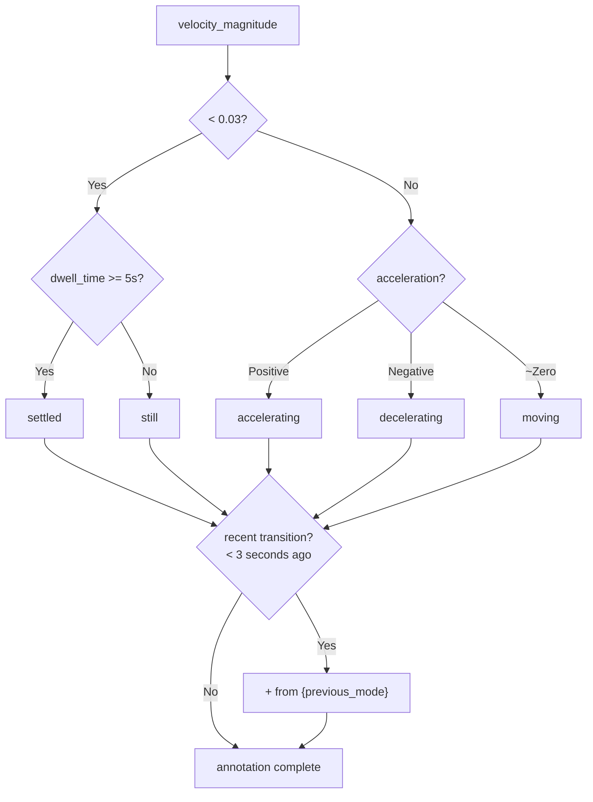
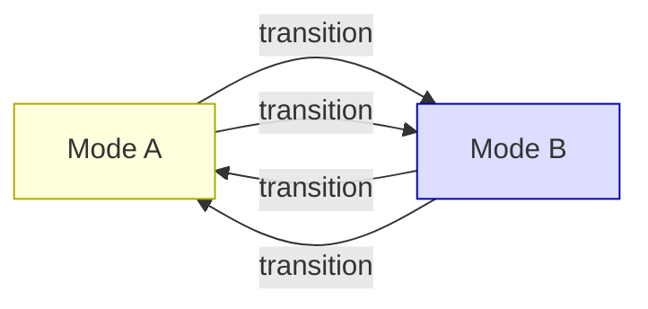

# Movement-Preserving Classification

This document describes the movement-preserving classification system introduced in EBS v1.1.0. The key insight: **threshold cuts discard movement**. "Settling from heightened alertness" is fundamentally different from "settling from rhythmic settling" — but hard thresholds give them the same label.

## Why Movement Matters

Traditional mode classification:
```
metrics → threshold → label
```

This loses information about *how* you arrived. Two people in "settling" mode may have very different autonomic histories.

Movement-preserving classification:
```
metrics → soft membership → hysteresis → label + movement annotation
```

This preserves the trajectory context: where you came from, how fast you're moving, whether you're settled or just passing through.

## System Overview



## The Six Modes

Modes are defined as centroids in a 4D feature space. Classification uses weighted distance, not hard thresholds.



### Mode Centroids

| Mode | Entrainment | Breath Steady | Amp Norm | Inv. Volatility |
|------|-------------|---------------|----------|-----------------|
| heightened alertness | 0.1 | 0.3 | 0.2 | 0.2 |
| subtle alertness | 0.25 | 0.3 | 0.35 | 0.4 |
| transitional | 0.4 | 0.3 | 0.45 | 0.6 |
| settling | 0.55 | 1.0 | 0.55 | 0.75 |
| rhythmic settling | 0.65 | 1.0 | 0.65 | 0.85 |
| settled presence | 0.8 | 1.0 | 0.75 | 0.95 |

### Feature Weights

```
entrainment:        40%
breath_steady:      30%
amp_norm:           20%
inverse_volatility: 10%
```

## Soft Mode Membership

Instead of hard thresholds, each moment has a **membership weight** across all modes. This preserves ambiguity at boundaries.



### Example Membership

At a boundary between settling and rhythmic settling:
```
settling:           0.38
rhythmic settling: 0.35
transitional:       0.15
subtle alertness:   0.08
heightened alertness: 0.03
settled presence:  0.01
---
ambiguity: 0.97 (1 - (0.38 - 0.35))
```

High ambiguity signals the system is at a transition boundary — valuable information that hard thresholds would discard.

## Hysteresis State Machine

Entry thresholds are **lower** than exit thresholds. This makes it easier to enter a state than to leave it, preventing oscillation at boundaries.



### State Definitions

| State | Meaning | Confidence Modifier |
|-------|---------|---------------------|
| `unknown` | No stable mode detected | — |
| `provisional` | Mode entered, not yet confirmed | × entry_penalty (0.75-0.9) |
| `established` | Mode confirmed, stable | × settled_bonus (1.05-1.15) |

### Threshold Configuration

| Mode | Entry | Exit | Provisional | Established |
|------|-------|------|-------------|-------------|
| heightened alertness | 0.18 | 0.24 | 3 samples | 8 samples |
| subtle alertness | 0.18 | 0.24 | 3 samples | 8 samples |
| transitional | 0.17 | 0.22 | 2 samples | 5 samples |
| settling | 0.19 | 0.25 | 3 samples | 10 samples |
| rhythmic settling | 0.20 | 0.26 | 3 samples | 10 samples |
| settled presence | 0.22 | 0.28 | 5 samples | 15 samples |

**Note:** Deeper states (settled presence) are harder to enter but also harder to leave — they have "stickiness" that respects the phenomenology of settled states.

## Movement Annotation

The annotation encodes **how** you arrived at the current state.



### Annotation Examples

| State | Annotation | Full Label |
|-------|------------|------------|
| Just entered settling from heightened alertness | `still from heightened alertness` | `settling (still from heightened alertness)` |
| Been in settling for 10 seconds | `settled` | `settling` |
| Moving through transitional | `moving` | `transitional (moving)` |
| Rapidly entering settled presence | `accelerating from settling` | `settled presence (accelerating from settling)` |

## Rupture Oscillation Detection

Rapid ABAB oscillation between two modes may indicate boundary instability or rupture.



Detection triggers when:
- 4+ transitions within 10 samples
- Alternating between exactly 2 modes

This pattern may warrant attention — the system is caught at a boundary and can't settle.

## Implementation

Movement-preserving classification is implemented in `src/processing/movement.py`:

- `SoftModeInference` — dataclass holding membership weights
- `ModeHistory` — tracks mode sequence for hysteresis
- `compute_soft_mode_membership()` — softmax on centroid distances
- `detect_mode_with_hysteresis()` — state machine for stable transitions
- `generate_movement_annotation()` — human-readable movement context

Called from `src/processing/phase.py` at 1Hz during trajectory computation.

## Session Data

v1.1.0 sessions include:

```json
{
  "phase": {
    "soft_mode": {
      "primary": "settling",
      "secondary": "rhythmic settling",
      "ambiguity": 0.92,
      "distribution_shift": 0.003,
      "membership": {
        "settling": 0.38,
        "rhythmic settling": 0.35,
        "transitional": 0.15
      }
    },
    "movement_annotation": "still from subtle alertness",
    "movement_aware_label": "settling (still from subtle alertness)",
    "mode_status": "provisional",
    "dwell_time": 2.4
  }
}
```

---

*"Where you are matters less than how you arrived. The path is the message."*
