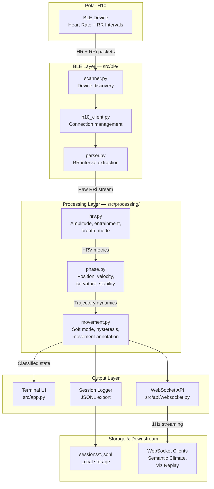

# EarthianBioSense Overview

EarthianBioSense (EBS) is a biosignal acquisition and analysis system that tracks autonomic state as a trajectory through phase space. It connects to Polar H10 heart rate monitors via BLE, computes HRV-derived metrics, and streams data for real-time coherence detection.

## Purpose

EBS serves as the **somatic stream** in the Earthian Ecological Coherence Protocol (EECP) - a research framework for studying coherence across human-AI-environment ecologies.

```
┌─────────────────────────────────────────────────────────────────┐
│                    EECP Ecosystem                               │
├─────────────────┬─────────────────┬─────────────────────────────┤
│ EarthianBioSense│ Semantic Climate│ Field Journal               │
│ (this system)   │                 │                             │
├─────────────────┼─────────────────┼─────────────────────────────┤
│ Biosignal       │ Semiotic        │ Phenomenological            │
│ Stream          │ Stream          │ Stream                      │
│                 │                 │                             │
│ • HRV metrics   │ • Token flow    │ • Somatic sensations        │
│ • Phase space   │ • Curvature Δκ  │ • Affective tone            │
│ • Autonomic     │ • Entropy ΔH    │ • Environmental notes       │
│   dynamics      │ • Coupling Ψ    │ • Ontological posture       │
└─────────────────┴─────────────────┴─────────────────────────────┘
                            ↓
              Ecological Coherence Detection
```

**Coherence is detected when both computational (Semantic Climate) and somatic (EBS) signatures shift together.**

## Core Insight

Traditional HRV analysis treats metrics as snapshots - isolated measurements at points in time. EBS treats the autonomic nervous system as a **dynamical system** moving through a phase space manifold.

The key shift: **where you are matters less than how you're moving**.

This allows detection of patterns invisible to snapshot metrics:

- Alert holding (stable but not relaxed)
- Seeking behavior (high curvature, searching for new configuration)
- Settling into coherence (approaching stable coherent state)
- Inflection points (trajectory turning sharply)

## What It Does

### Signal Acquisition

- Connects to Polar H10 via Bluetooth Low Energy (BLE)
- Receives heart rate and RR intervals (beat-to-beat timing)
- Maintains rolling buffer for windowed analysis

### Metric Computation

- **Amplitude**: HRV range (max - min RRi) - variability magnitude
- **Entrainment**: Breath-heart phase coupling (autocorrelation-based, 0-1)
- **Breath rate**: Estimated from RRi oscillation patterns
- **Volatility**: Normalized instability measure
- **Mode**: Autonomic state inference (alertness → settling → coherence)

### Phase Space Tracking

- Maps metrics to 3D coordinates: (entrainment, breath_normalized, amplitude_normalized)
- Computes trajectory dynamics: velocity, curvature, stability
- Labels trajectory segments based on movement patterns
- Maintains history signature for accumulated complexity

### Output

- **Terminal UI**: Real-time ASCII visualization of metrics and trajectory
- **JSONL export**: Complete session data for post-analysis
- **WebSocket API**: Real-time streaming to downstream clients (E.g., Semantic Climate and Field Journal)

## Architecture



### Data Flow Summary

| Stage | Input | Output | Rate |
|-------|-------|--------|------|
| BLE | Bluetooth packets | HR, RRi arrays | ~1Hz (per heartbeat) |
| HRV | Rolling RRi window (20 samples) | Amplitude, entrainment, breath, mode | Every packet |
| Phase | HRV metrics | Position, velocity, curvature, stability | 1Hz |
| Movement | Phase dynamics | Soft mode, movement annotation, labels | 1Hz |
| Output | Classified state | Terminal, JSONL, WebSocket | 1Hz |

## Key Concepts

### Phase Space Model

The autonomic state is represented as a point in 3D space:

- **X-axis (Entrainment)**: 0 = low breath-heart coupling, 1 = high rhythmic synchronization
- **Y-axis (Breath)**: Normalized breath rate (0 = slow, 1 = fast)
- **Z-axis (Amplitude)**: Normalized HRV amplitude (0 = contracted, 1 = expanded)

The trajectory through this space reveals the *dynamics* of autonomic regulation - not just what state you're in, but how you're moving between states.

### Trajectory Dynamics

- **Velocity**: Rate of change in phase space. High velocity = rapid state change.
- **Curvature**: How sharply the trajectory is bending. High curvature = inflection point.
- **Stability**: Inverse of velocity + curvature. High stability = dwelling in a region.

### Phase Labels

Labels emerge from trajectory dynamics, not arbitrary thresholds:

| Label | Signature | Meaning |
|-------|-----------|---------|
| `alert stillness` | Low velocity, low-mid entrainment | Watchful calm without release |
| `active transition` | High velocity | Moving between states |
| `inflection (seeking)` | High curvature | Searching for new configuration |
| `settling into coherence` | Decreasing velocity, rising entrainment | Approaching coherent state |
| `coherent dwelling` | Low velocity, high entrainment, stable | Dwelling in flow state |

### Mode Labels

Autonomic mode inference based on metric patterns:

| Mode | Autonomic Signature |
|------|---------------------|
| `heightened alertness` | Sympathetic activation |
| `subtle alertness` | Mild watchfulness |
| `transitional` | Between states |
| `settling` | Moving toward parasympathetic |
| `rhythmic settling` | Rhythmic settling establishing |

## Data Format

Session data is stored as JSONL (one JSON object per line):

```json
{
  "ts": "2025-12-01T16:49:18.274140",
  "hr": 86,
  "rr": [640, 634, 637],
  "metrics": {
    "amp": 164,
    "ent": 0.576,
    "ent_label": "[entrained]",
    "breath": 6.2,
    "volatility": 0.0825,
    "mode": "settling",
    "mode_score": 0.543
  },
  "phase": {
    "position": [0.5759, 0.5, 0.82],
    "velocity": [0.0413, 0.0, 0.0333],
    "velocity_mag": 0.0531,
    "curvature": 0.047,
    "stability": 0.8672,
    "history_signature": 0.2292,
    "phase_label": "settling into coherence",
    "coherence": 0.55,
    "movement_annotation": "settling from heightened alertness",
    "movement_aware_label": "settling · from heightened alertness"
  }
}
```

## Requirements

- Python 3.11+
- Polar H10 heart rate monitor
- macOS or Linux with Bluetooth
- Dependencies: `bleak`, `aiohttp`, `websockets`, `numpy`

## Current Status

**Phase 1c Complete**: Core biosignal pipeline operational with WebSocket API ready for integration with Semantic Climate.

See [WebSocket API Specification](../specs/websocket-api-v0.1.md) for streaming protocol details.

## Related Documentation

- [Session Interpreter Prompt](../prompts/session-interpreter.md) - GPT prompt for analyzing session data
- [WebSocket API v0.1](../specs/websocket-api-v0.1.md) - Streaming protocol specification
- [Pi Field Node Specification](../specs/pi-field-node-v0.1.md) - Portable hardware design

---

*"Each moment is a point on a trajectory, not a dot on a line. Movement matters."*
