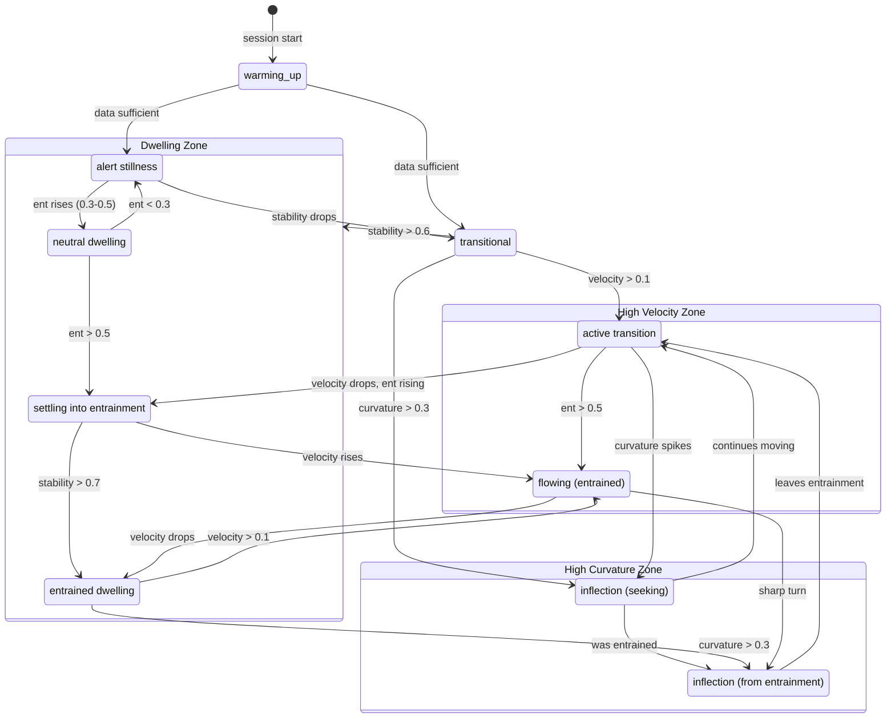
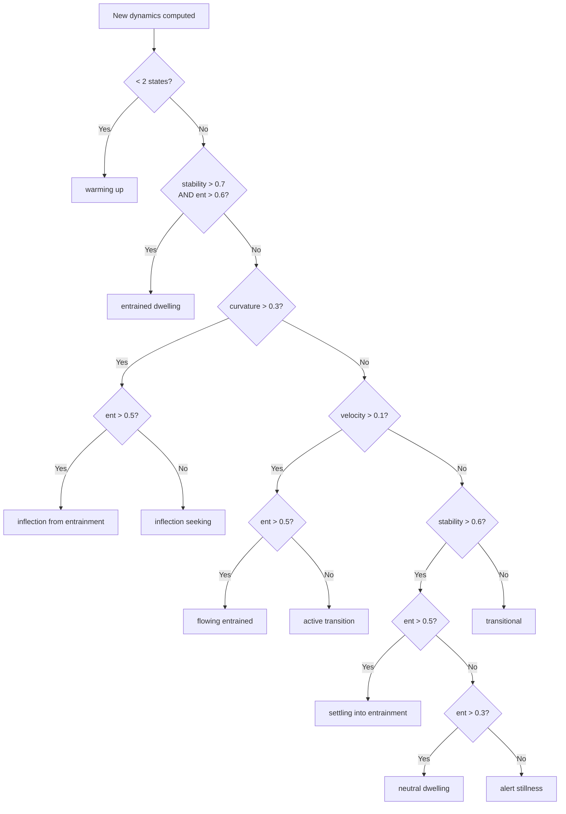
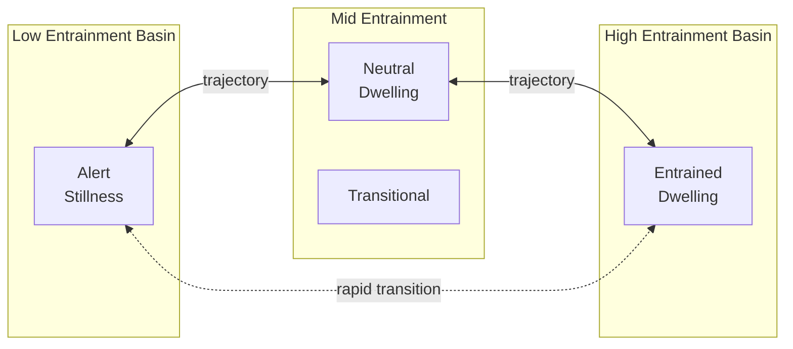

# Phase Space Model

This document describes the phase space representation used by EarthianBioSense - how metrics are mapped to a 3D manifold, how trajectory dynamics are computed, and how phase labels emerge from movement patterns.

## Why Phase Space?

Traditional HRV analysis produces metrics as isolated numbers: "Your coherence is 0.45." This tells you where you are but nothing about:

- How you got there
- Whether you're settling or leaving
- How fast you're moving
- Whether you're at an inflection point

Phase space representation solves this by treating metrics as *coordinates* in a space. As metrics change over time, they trace a **trajectory**. The shape and dynamics of that trajectory reveal patterns invisible to snapshot metrics.

## The 3D Manifold

EBS maps autonomic state to a point in 3D space:

```
        Entrainment (X)
        0 ─────────── 1
        │
        │     ┌───────────────┐
        │    /               /│
        │   /   PHASE       / │
        │  /    SPACE      /  │
        │ /               /   │ Amplitude (Z)
        │┌───────────────┐    │ 0
        ││               │    │ │
        ││       •       │    │ │
        ││    (state)    │   /  │
        ││               │  /   1
        │└───────────────┘ /
        │ └───────────────┘
        │
        1 ─────────── 0
        Breath (Y)
```

### Axes

| Axis | Metric | Range | Low End | High End |
|------|--------|-------|---------|----------|
| X | Entrainment | 0-1 | Low breath-heart coupling | High rhythmic sync |
| Y | Breath (normalized) | 0-1 | Slow breath | Fast breath |
| Z | Amplitude (normalized) | 0-1 | Contracted variability | Expanded variability |

### Normalization

- **Entrainment**: Already 0-1 from autocorrelation calculation
- **Breath**: Normalized against typical range (4-20 bpm → 0-1)
- **Amplitude**: Normalized against 200ms maximum (0-200ms → 0-1)

### Why These Axes?

These three dimensions capture complementary aspects of autonomic state:

1. **Entrainment** - The *coupling* of breath and heart (is there rhythmic sync?)
2. **Breath** - The *respiratory rate* (what's driving the rhythm?)
3. **Amplitude** - The *magnitude* of variability (how much room to move?)

Together, they define a space where different autonomic configurations occupy distinct regions.

## Trajectory

As metrics update (~1 Hz), the position in phase space changes. The sequence of positions forms a **trajectory** - a path through the 3D space.

```
       ┌──────────────────────────────────────┐
       │                                      │
       │    ·                                 │
       │     ·                                │
       │      ···                             │
       │         ····                         │
       │             ·····                    │
       │                  ······              │
       │                        ·······       │
       │                               ····•  │  ← current position
       │                                      │
       └──────────────────────────────────────┘

       trajectory over time →
```

The trajectory carries information that the current position alone does not:

- Direction of movement
- Speed of change
- Curvature (turning points)
- History (where you've been)

## Trajectory Dynamics

EBS computes several dynamic properties from the trajectory:

### Position

```python
position = [coherence, breath_normalized, amplitude_normalized]
```

A 3D vector representing current location in phase space.

### Velocity

```python
velocity = position_current - position_previous
velocity_magnitude = sqrt(vx² + vy² + vz²)
```

Rate of change in phase space. High velocity means the state is changing rapidly.

| Velocity | Interpretation |
|----------|----------------|
| < 0.05 | Dwelling - stable in current region |
| 0.05-0.15 | Moderate movement |
| > 0.15 | Rapid transition |

### Curvature

Curvature measures how sharply the trajectory is bending - the rate of change of direction.

```python
# Simplified: angle between recent velocity vectors
curvature = angle_change / path_length
```

High curvature indicates an **inflection point** - the system is turning, changing direction. These moments often correspond to:

- Seeking a new state
- Being perturbed
- Transitioning between attractor basins

| Curvature | Interpretation |
|-----------|----------------|
| < 0.1 | Straight path - consistent direction |
| 0.1-0.3 | Moderate bending |
| > 0.3 | Sharp turn - inflection point |

### Stability

Stability is the inverse of velocity and curvature combined:

```python
stability = 1 / (1 + velocity_magnitude + curvature)
```

High stability means the system is dwelling - low movement, low turning. The trajectory is staying in one region.

| Stability | Interpretation |
|-----------|----------------|
| < 0.5 | Unstable - moving and/or turning |
| 0.5-0.8 | Moderate stability |
| > 0.8 | Highly stable - dwelling |
| ~1.0 | Frozen - no movement at all |

### History Signature

A measure of accumulated trajectory complexity over the session:

```python
history_signature = accumulated_path_length / session_duration
```

Captures how much "ground" has been covered in phase space. A high history signature means the trajectory has been active - lots of movement. A low signature means relatively stationary.

## Phase Labels

Phase labels emerge from trajectory dynamics, not arbitrary thresholds on position. The labeling algorithm considers:

1. Current position (which region of phase space)
2. Velocity (how fast moving)
3. Curvature (how sharply turning)
4. Stability (dwelling vs. transitioning)
5. Recent history (where coming from)

### State Machine



### Label Definitions

| Label | Conditions | Meaning |
|-------|------------|---------|
| `warming up` | < 2 data points | Insufficient data (session start) |
| `entrained dwelling` | stability > 0.7, ent > 0.6 | Stable in breath-heart sync |
| `inflection (from entrainment)` | curvature > 0.3, ent > 0.5 | Leaving entrained state |
| `inflection (seeking)` | curvature > 0.3, ent ≤ 0.5 | Turning sharply, searching |
| `flowing (entrained)` | velocity > 0.1, ent > 0.5 | Moving within entrained region |
| `active transition` | velocity > 0.1, ent ≤ 0.5 | Moving through phase space |
| `settling into entrainment` | stability > 0.6, ent > 0.5 | Approaching entrained region |
| `neutral dwelling` | stability > 0.6, ent 0.3-0.5 | Stable, mid-entrainment |
| `alert stillness` | stability > 0.6, ent < 0.3 | Stable but not synced — watchful |
| `transitional` | default | Between defined states |

### Decision Flow



### What Labels Capture

Labels make visible patterns that would otherwise require expert interpretation of raw trajectories:

- **Alert stillness**: The system is stable but held — not relaxed, not activated. Common during cognitive load, emotional processing, or sustained attention.

- **Inflection (seeking)**: A turning point where the system is searching for a new configuration. Often precedes state change.

- **Settling into entrainment**: The characteristic approach to breath-heart sync — velocity decreasing as entrainment rises. Landing.

- **Entrained dwelling**: Stable in rhythmic breath-heart coupling — the "settled" state for many practices.

## Attractor Basins

Different autonomic configurations can be thought of as **attractor basins** — regions of phase space that the system tends to settle into.



The trajectory moves between basins. The dynamics of that movement — how fast, how directly, how much searching — reveal something about the regulatory capacity of the system.

**Basin characteristics:**

| Basin | Entrainment | Stability | Quality |
|-------|-------------|-----------|---------|
| Alert | < 0.3 | High | Watchful, held, sympathetic tone |
| Neutral | 0.3 - 0.5 | Variable | Flexible, exploratory |
| Entrained | > 0.6 | High | Synchronized, parasympathetic tone |

## Implementation

Phase space computation is implemented in `src/processing/phase.py`:

- `PhaseTrajectory` class maintains trajectory history (rolling buffer)
- Position updated with each new metric computation (~1Hz)
- Dynamics computed from recent positions (velocity, curvature, stability)
- Labels assigned based on current dynamics
- Movement-preserving classification via `src/processing/movement.py` (v1.1.0)

### Parameters

| Parameter | Value | Purpose |
|-----------|-------|---------|
| History window | 30 samples | Trajectory dynamics computation |
| Velocity threshold | 0.1 | Active transition detection |
| Curvature threshold | 0.3 | Inflection detection |
| Stability threshold | 0.6 / 0.7 | Dwelling / entrained dwelling detection |

## Visualizing Phase Space

The terminal UI provides real-time metrics. The `viz/` replay tool provides:

- 2D temporal view (metrics over time)
- 3D topological view (trajectory through manifold)
- Region boundaries (alert zone, entrained zone)

See `viz/DESIGN_PRINCIPLES.md` for visualization ethics and approach.

---

*"The trajectory is the message. Position is just where you happen to be reading it."*
